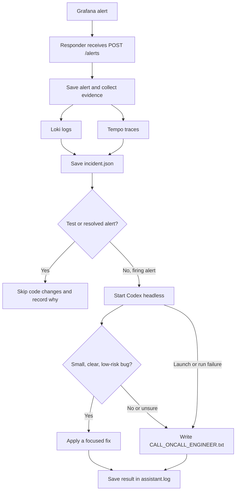

# Order Tracker

A small order tracking app for the AI Dev Tools Zoomcamp observability homework. It includes a web page, API, tests, and a Docker Compose setup. You add telemetry, alerts, and an incident responder in Homework 4.

The main user flow is creating an order and checking its status. Three sample orders are created on first startup.

## Run it

You need Docker with Compose. To run the tests, you also need Python 3.11+ and `uv`.

```bash
docker compose up --build -d --wait
```

Open <http://127.0.0.1:8000>. The API is at `/api/orders`, and the health check is at `/healthz`. Data is stored in a Docker volume and survives container recreation.

If port 8000 is occupied, set `ORDER_TRACKER_PORT`, for example:

```bash
ORDER_TRACKER_PORT=18080 docker compose up --build -d --wait
```

Run tests with `uv run --frozen pytest -q`. Stop the app with `docker compose down`. Add `-v` only if you also want to delete the order data.

## API

| Method | Path | Purpose |
| --- | --- | --- |
| GET | `/` | Web page |
| GET | `/healthz` | Database health check |
| GET | `/api/orders` | List orders |
| POST | `/api/orders` | Create an order |
| GET | `/api/orders/{id}` | Check an order |
| PATCH | `/api/orders/{id}` | Change an order status |

The app uses SQLite to keep setup small. Run one app container at a time. The course exercise is about detecting and handling an incident, not scaling the database.

## Observability stack

Order lookups (`GET /api/orders/{id}`) send traces, structured logs, and a request counter through the OpenTelemetry Collector. The counter includes the resolved route and HTTP status code. The Collector sends metrics to Prometheus, logs to Loki, and traces to Tempo. Grafana provisions all three data sources and the **Order Tracker Requests** dashboard automatically.

Start the full stack with the same command:

```bash
docker compose up --build -d --wait
```

Open Grafana at <http://127.0.0.1:3000> and sign in with `admin` / `admin` by default. Override these credentials with `GRAFANA_USER` and `GRAFANA_PASSWORD`. The **Order Tracker Requests** dashboard shows lookup request rates by HTTP status and lookup errors (4xx and 5xx). The provisioned **Order lookup 5xx responses** alert fires when a 5xx is seen on `GET /api/orders/{order_id}` in a rolling five-minute window; an empty 5xx result is treated as zero. Prometheus is also available at <http://127.0.0.1:9090>. Override host ports with `GRAFANA_PORT` or `PROMETHEUS_PORT` if needed.

Make a successful and a missing-order request to populate the dashboard:

```bash
curl http://127.0.0.1:8000/api/orders/standard-1001
curl http://127.0.0.1:8000/api/orders/missing
```

Telemetry is stored in Docker volumes for Prometheus, Loki, Tempo, and Grafana. `docker compose down -v` removes this telemetry data along with the existing order data. Collector diagnostics remain visible with `docker compose logs otel-collector`.

## Incident response

Grafana sends firing and resolved notifications to the local incident responder at `POST /alerts` on port `8001`. The responder stores each alert under `incident-response/incidents/` with alert labels and annotations, the affected endpoint, dashboard links, nearby Loki logs, a Tempo trace search, and the assistant output. These files are local runtime data and are ignored by Git.



Each alert's files are grouped in its own folder under `incident-response/incidents/`.

Run the responder on the host so it can use the installed Codex CLI and read this checkout:

```powershell
$env:UV_CACHE_DIR="$PWD\.uv-cache"
uv run --frozen uvicorn main:app --app-dir incident-response --host 0.0.0.0 --port 8001
```

Start the responder before the Compose stack. Grafana's provisioned webhook uses `host.docker.internal`, supported by Docker Desktop on Windows. Loki and Tempo are exposed on host loopback ports `3100` and `3200` so the responder can retrieve evidence. Codex runs as `codex exec` with `gpt-6-luna` by default, a workspace-write sandbox, and approval policy set to `never`. It automatically applies only clear, low-risk fixes localized to at most two application source files; uncertain or broader incidents get a `CALL_ONCALL_ENGINEER.txt` marker in their incident folder. Test and resolved notifications are recorded without starting code changes. Set `CODEX_COMMAND` if the CLI executable has a different name and `CODEX_MODEL` to select another model available to the signed-in ChatGPT account. `LOKI_URL`, `TEMPO_URL`, `INCIDENTS_DIR`, `ALERT_LOOKBACK_MINUTES`, `TELEMETRY_TIMEOUT_SECONDS`, and `ASSISTANT_TIMEOUT_SECONDS` configure local behavior.
